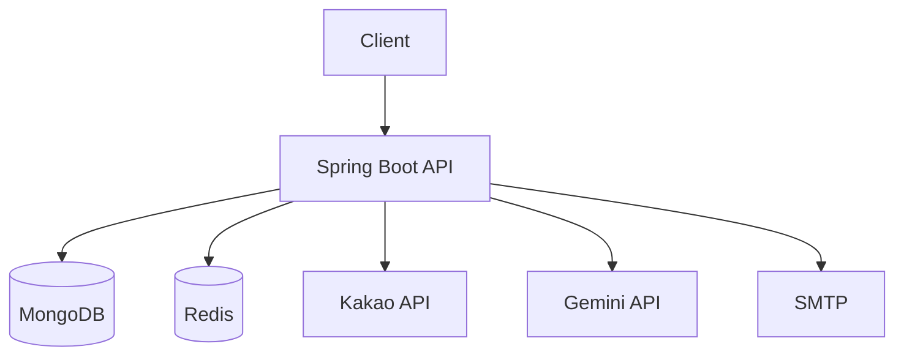

# Solo-Play Web Server
> **한 줄 소개**: 1인 사용자 맞춤 활동 추천을 위한 인증·추천·외부 API 연동 백엔드

## 1. 프로젝트 개요 (Overview)
- **개발 기간**: 2024.10 ~ 진행 중
- **개발 인원**: 백엔드 1명, 프론트 협업
- **프로젝트 목적**: 사용자 인증과 추천 데이터 파이프라인을 결합해 개인화된 솔로 라이프 추천 제공
- **GitHub**: https://github.com/stdiodh/Solo-Play-Web-Server

## 2. 사용 기술 및 선정 이유 (Tech Stack & Decision)

| Category | Tech Stack | Version | Decision Reason (Why?) |
| --- | --- | --- | --- |
| **Language** | Kotlin | 1.9.25 | 도메인 모델과 서비스 로직을 간결하게 유지하고 null 안정성 확보 |
| **Framework** | Spring Boot + WebFlux + Security | 3.3.5 | 외부 API 연동과 인증 처리를 비동기/보안 구조로 일관성 있게 구성 |
| **Database** | MongoDB | - | 추천 장소/사용자 데이터의 유연한 문서 스키마 관리 목적 |
| **Cache** | Redis | - | 인증/검증 코드와 단기 상태 데이터의 TTL 기반 관리 |
| **External** | Kakao API, Gemini API, SMTP | - | 장소 데이터 확장, 추천 고도화, 이메일 인증 자동화 |

## 3. 시스템 아키텍처 (System Architecture)

- **설계 특징**:
- `auth` / `place` / `common` 패키지로 기능 경계 분리
- JWT + RefreshToken 저장소를 분리해 인증 수명주기 명확화
- 외부 API 호출은 서비스 계층으로 캡슐화하여 교체 가능성 확보

## 4. 핵심 기능 (Key Features)
- **회원 인증**: 회원가입/로그인/JWT 발급/토큰 재발급 흐름 제공
- **이메일 인증**: 인증 코드 발급 및 검증 기반 가입 절차 지원
- **장소 추천**: 카테고리/지역 기반 장소 탐색 및 추천 처리
- **외부 데이터 보강**: Kakao/Gemini 연동으로 장소 정보/설명 보강

## 5. 트러블 슈팅 및 성능 개선 (Troubleshooting & Refactoring)
### 5-1. 외부 API 연동 실패 전파 제어
- **문제(Problem)**: 외부 API 응답 지연/실패가 추천 API 전체 실패로 이어질 위험
- **원인(Cause)**: 추천 응답 조합 단계에서 외부 호출 예외를 직접 전파하면 사용자 응답까지 실패
- **해결(Solution)**:
  1. 외부 연동 로직을 `KakaoApiService`, `PlaceEnrichmentService`로 분리
  2. 예외를 공통 예외 핸들러로 일원화해 응답 형식을 고정
- **검증(Verification)**: 외부 API 키 누락/타임아웃 시나리오에서 에러 응답 포맷 일관성 확인
- **결과(Result)**: 장애 원인 구분이 쉬워지고 API 실패 분석 시간 단축

### 5-2. 인증/검증 상태 데이터 관리 일관성
- **문제(Problem)**: 인증 코드/토큰 상태가 분산되면 만료 정책 누락 위험
- **원인(Cause)**: 기능별로 TTL 처리 방식이 다르면 만료/삭제 타이밍 불일치 발생
- **해결(Solution)**:
  1. Redis 저장소 계층(`AbstractRedisRepository`)로 TTL 정책 공통화
  2. 인증/토큰 저장소를 도메인별로 분리해 책임 명확화
- **검증(Verification)**: 인증 코드/토큰 발급 후 만료 시점 재조회 테스트로 삭제 동작 확인
- **결과(Result)**: 만료 데이터 정리와 인증 흐름 유지보수성 향상

## 6. 프로젝트 회고 (Retrospective)
- **배운 점**: 추천 서비스는 모델보다 인증/외부연동 안정성 확보가 먼저 필요
- **아쉬운 점 & 향후 계획**: 추천 품질 지표(클릭률/재방문)를 측정할 관측 지표를 추가할 계획

## 7. API 명세
- API 요약 문서: `/Users/dh/Desktop/Code/Project/Soloplay/Solo-Play-Web-Server/docs/API_SPEC.md`
