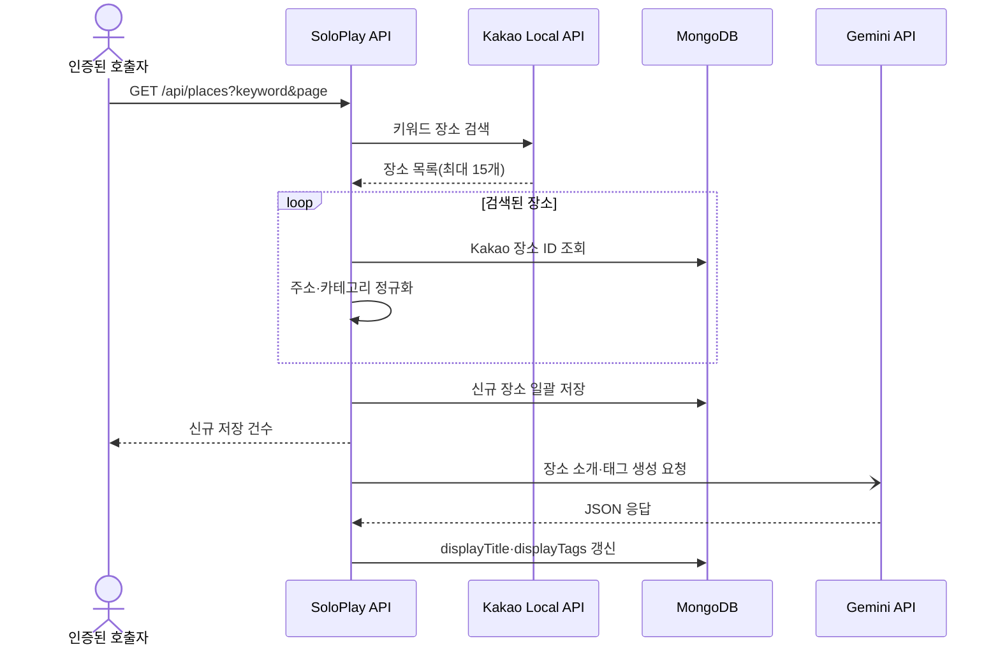

# SoloPlay Backend

> Kakao Local API에서 1인 활동 장소를 수집하고, Gemini로 짧은 소개와 태그를 보강해 제공하는 Kotlin·Spring WebFlux 백엔드입니다.

SoloPlay는 혼자 시간을 보내는 사용자가 새로운 활동 장소를 탐색하도록 돕는 서비스입니다. 현재 백엔드는 장소 수집·콘텐츠 보강·레벨별 조회와 이메일 인증 기반 회원가입·JWT 인증을 지원합니다.

| 구분 | 내용 |
| --- | --- |
| 팀 프로젝트 | 2024.10.28–2025.02 |
| 후속 백엔드 고도화 | 2025.03–2025.10.09 (저장소 커밋 이력 기준) |
| Backend | [Hood](https://github.com/stdiodh) |

## 담당 영역

- Kakao 장소 수집·도메인 정규화·중복 제거 파이프라인 구현
- 원본 저장과 Gemini 소개·해시태그 보강 작업 분리
- Redis 일회성 가입 증표와 JWT 기반 인증 흐름 구현

## 장소 수집·콘텐츠 보강 파이프라인

`GET /api/places`는 키워드와 페이지를 받아 Kakao Local API에서 최대 15개 장소를 조회합니다. 주소의 자치구와 Kakao 카테고리를 서비스 값으로 정규화하고, 매핑할 수 없는 데이터는 제외합니다.

신규 장소는 Gemini 호출 전에 MongoDB에 저장합니다. 이후 별도 Coroutine이 장소 이름·카테고리·주소를 바탕으로 약 15자의 한글 소개와 해시태그 3–5개를 생성해 `displayTitle`, `displayTags`에 반영합니다.

### 설계 결정

- Kakao 장소 ID 사전 조회와 `kakaoPlaceId` 고유 인덱스를 함께 사용해 반복 수집을 방지합니다.
- 원본 저장과 AI 보강을 분리해 Gemini 호출·파싱 실패가 수집 데이터에 영향을 주지 않게 했습니다.
- Gemini는 추천 순위가 아니라 사용자에게 노출할 소개와 태그만 생성합니다.

## 일회성 가입 증표를 이용한 회원가입

회원가입을 `인증 코드 발송 → 코드 확인과 가입 증표 발급 → 가입 증표 제출`의 세 단계로 분리했습니다.

1. 이메일로 6자리 인증 코드를 발송하고 Redis에 10분간 저장합니다.
2. 코드가 일치하면 이메일에 대응하는 가입 증표를 발급하고 Redis에 10분간 저장합니다.
3. 회원가입 시 증표를 Redis `GETDEL`로 조회와 동시에 삭제해 한 번만 사용할 수 있도록 합니다.

비밀번호는 BCrypt로 암호화해 MongoDB에 저장합니다. 로그인 시 Access Token과 Refresh Token을 발급하고, Refresh Token은 설정된 만료 시간 동안 Redis에 보관합니다. 로그아웃은 해당 사용자의 Refresh Token을 삭제합니다.

## 장소 데이터 처리 흐름



## 관련 코드

- 장소 수집·저장: [KakaoApiService.kt](src/main/kotlin/com/example/solo_play_web_server/place/service/KakaoApiService.kt), [PlaceService.kt](src/main/kotlin/com/example/solo_play_web_server/place/service/PlaceService.kt), [Place.kt](src/main/kotlin/com/example/solo_play_web_server/place/entity/Place.kt)
- 콘텐츠 보강: [PlaceEnrichmentService.kt](src/main/kotlin/com/example/solo_play_web_server/place/service/PlaceEnrichmentService.kt), [GeminiDto.kt](src/main/kotlin/com/example/solo_play_web_server/place/dto/GeminiDto.kt)
- 가입·인증: [EmailVerificationService.kt](src/main/kotlin/com/example/solo_play_web_server/auth/service/EmailVerificationService.kt), [MemberService.kt](src/main/kotlin/com/example/solo_play_web_server/auth/service/MemberService.kt), [SignUpProofRepository.kt](src/main/kotlin/com/example/solo_play_web_server/auth/repository/SignUpProofRepository.kt), [AbstractRedisRepository.kt](src/main/kotlin/com/example/solo_play_web_server/common/repository/AbstractRedisRepository.kt), [JwtAuthenticationFilter.kt](src/main/kotlin/com/example/solo_play_web_server/common/auth/JwtAuthenticationFilter.kt), [SecurityConfig.kt](src/main/kotlin/com/example/solo_play_web_server/common/config/SecurityConfig.kt)
- 테스트: [KakaoApiServiceSpec.kt](src/test/kotlin/com/example/solo_play_web_server/place/service/KakaoApiServiceSpec.kt), [PlaceServiceSpec.kt](src/test/kotlin/com/example/solo_play_web_server/place/service/PlaceServiceSpec.kt), [PlaceEnrichmentServiceSpec.kt](src/test/kotlin/com/example/solo_play_web_server/place/service/PlaceEnrichmentServiceSpec.kt)

## 저장소별 책임

| 저장소 | 저장 데이터 | 사용 목적 |
| --- | --- | --- |
| MongoDB | `users`, `places` | 회원과 장소의 영속 데이터 |
| Redis | 인증 코드·가입 증표·Refresh Token | TTL 인증 데이터와 로그인 세션 관리 |

## API

Swagger UI는 애플리케이션 실행 후 `/swagger-ui/index.html`에서 확인할 수 있습니다.

| Method | Path | 접근 조건 | 설명 |
| --- | --- | --- | --- |
| `GET` | `/api/auth/check-email-duplicate` | 공개 | 이메일 중복 확인 |
| `POST` | `/api/auth/email-verify` | 공개 | 회원가입 인증 코드 발송 |
| `POST` | `/api/auth/email-confirm` | 공개 | 인증 코드 확인과 가입 증표 발급 |
| `POST` | `/api/auth/signup` | 공개 | 가입 증표를 사용한 회원가입 |
| `POST` | `/api/auth/login` | 공개 | Access·Refresh Token 발급 |
| `POST` | `/api/auth/logout` | JWT | Refresh Token 삭제 |
| `GET` | `/api/places` | JWT | Kakao 장소 검색·신규 데이터 저장 |
| `GET` | `/api/places/recommendations` | `USER` 역할 | 요청한 레벨 조건으로 장소 목록 조회 |

## 기술 스택

| 영역 | 기술 | 사용 목적 |
| --- | --- | --- |
| Language / Runtime | Kotlin 1.9.25, Java 21 | Coroutine 기반 서버 로직 |
| Framework | Spring Boot 3.3.5, Spring WebFlux | 비동기 HTTP API |
| Data | Reactive MongoDB, Reactive Redis | 장소·회원 영속화와 TTL 데이터 관리 |
| Security | Spring Security, JWT, BCrypt | 인증·인가와 비밀번호 암호화 |
| External API | WebClient, Kakao Local API, Gemini API | 장소 수집과 콘텐츠 보강 |
| Mail | Spring Mail, Thymeleaf, Gmail SMTP | HTML 인증 메일 발송 |
| Test | Kotest, MockK, coroutine-test, StepVerifier, MockWebServer, WebTestClient, JaCoCo | Coroutine·Reactive·외부 API·HTTP 계약과 커버리지 검증 |
| Infra | Docker, Docker Compose, GitHub Actions, AWS EC2 | 이미지 빌드와 서버 배포 |

## 테스트

외부 API는 실제 네트워크 대신 localhost MockWebServer로 요청 경로·헤더·성공·오류 응답을 검증합니다. 서비스 계층은 MockK로 저장소와 외부 의존성을 분리하고, Controller는 실제 WebFlux 보안 체인을 적용한 슬라이스 테스트로 HTTP 상태와 응답 구조를 확인합니다.

| 대상 | 주요 검증 |
| --- | --- |
| 외부 API·장소 | Kakao 요청·상태별 오류, ID 중복·무효 장소 제외, Gemini 응답 저장·실패 격리 |
| 가입·Redis | 인증 코드·가입 증표 TTL과 원자 소비, 회원가입·로그인·로그아웃, Refresh Token |
| JWT·보안 | 만료·변조·서명·role 복원, Bearer 필터와 Reactive SecurityContext |
| HTTP·권한 | validation 필드 오류, 비즈니스 예외, 인증 역할에 따른 장소·회원 API 계약 |

현재 `develop` 기준 전체 99개 테스트가 통과합니다. JaCoCo는 custom exclusion 없이 전체 프로덕션 코드를 측정하며 LINE 87%, BRANCH 73% ratchet을 `check`에 적용합니다. 최초·최종 covered/missed 수치는 [커버리지 기준선 문서](docs/testing/coverage-baseline.md)에서 확인할 수 있습니다.

```bash
./gradlew clean check --no-daemon
```

## 로컬 실행

### 요구 사항

- JDK 21
- MongoDB
- Redis

### 환경 변수

루트의 `.env` 파일 또는 실행 환경에 외부 API·메일·인증 설정을 입력합니다. 실제 비밀값은 저장소에 커밋하지 않습니다.

| 변수 | 설명 |
| --- | --- |
| `MONGO_DB_URL` | MongoDB 연결 URI |
| `REDIS_HOST` | Redis 호스트 |
| `REDIS_PORT` | Redis 포트 |
| `GOOGLE_ID` | 인증 메일 발송 계정 |
| `APP_PASSWORD` | Gmail 앱 비밀번호 |
| `JWT_SECRET` | JWT 서명 키 |
| `ACCESS_EXPIRY` | Access Token 만료 시간(ms) |
| `REFRESH_EXPIRY` | Refresh Token 만료 시간(ms) |
| `KAKAO_API_KEY` | Kakao REST API 키 |
| `GEMINI_API_KEY` | Gemini API 키 |
| `GEMINI_API_URL` | Gemini 요청 URL |

### 실행

```bash
./gradlew bootRun
```

## 배포

`develop` 브랜치 변경 시 두 GitHub Actions Workflow가 독립적으로 실행됩니다.

- `test-cicd.yml`: JDK 21 환경에서 `./gradlew clean check --no-daemon`으로 테스트와 커버리지 gate 실행
- `deploy-dev.yml`: 애플리케이션과 Docker 이미지를 빌드해 DockerHub에 올리고, EC2에서 Docker Compose로 갱신

배포 Workflow는 테스트를 실행하지 않으므로 테스트 성공이 배포의 선행 조건으로 연결되지는 않습니다.

## 현재 범위와 한계

- 신규 수집 장소는 현재 `Level.ONE`으로 초기화하며, 사용자 행동을 분석해 레벨을 결정하지 않습니다.
- 레벨별 장소 조회는 현재 레벨 조건 필터만 지원하며, 무작위 정렬과 10개 제한은 적용하지 않았습니다.
- Gemini 출력 형식은 프롬프트로 요청하지만 길이·태그 개수를 별도로 검증하거나 실패 작업을 재시도하지 않습니다.

## 팀

| 역할 | 이름 |
| --- | --- |
| Frontend | [Han Sang Wook](https://github.com/SangWook16074), Kim Dong Wook |
| Backend | [Hood](https://github.com/stdiodh) |
